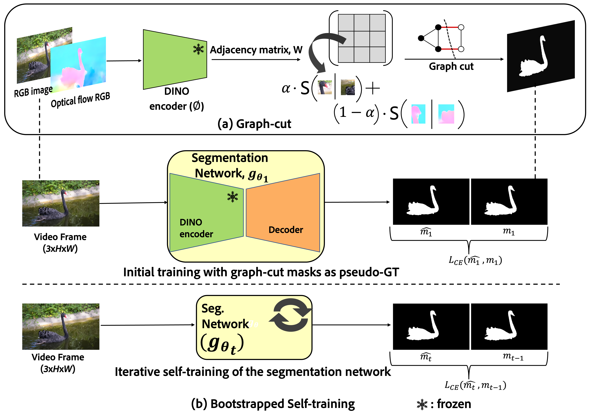

# LOCATE
[BMVC 2023] Official repository for "LOCATE: Self-supervised Object Discovery via Flow-guided Graph-cut and Bootstrapped Self-training"  
*Silky Singh, Shripad Deshmukh, Mausoom Sarkar, Balaji Krishnamurthy.*


Our self-supervised framework LOCATE trained on video datasets can perform object segmentation on standalone images.

<!--  -->

## Installation

### Create a conda environment

```
conda create -n locate python=3.8
conda activate locate
```

The code has been tested with `python=3.8`, `pytorch=1.12.1`, `torchvision=0.13.1` with `cudatoolkit=11.3` on Nvidia A100 machine.

Use the official Pytorch installation instructions provided [here](https://pytorch.org/get-started/previous-versions/).

Other dependencies can be installed following the [guess-what-moves](https://github.com/karazijal/guess-what-moves) repository. It is mentioned below for completeness.

```
conda install -y pytorch==1.12.1 torchvision==0.13.1 cudatoolkit=11.3 -c pytorch
conda install -y kornia jupyter tensorboard timm einops scikit-learn scikit-image openexr-python tqdm gcc_linux-64=11 gxx_linux-64=11 fontconfig -c conda-forge
pip install cvbase opencv-python wandb 
python -m pip install 'git+https://github.com/facebookresearch/detectron2.git'
```


## Datasets

We have tested our method on video object segmentation datasets (DAVIS 2016, FBMS59, SegTrackv2), image saliency detection (DUTS, ECSSD, OMRON) and object segmentation (CUB, Flowers-102) benchmarks.  


## Training

### Step 1. Graph Cut

We utilise the MaskCut algorithm from the CutLER's repository [[link](https://github.com/facebookresearch/CutLER)] with `N=1` to get the segmentation mask for the salient object in all the video frames independently. We modify the pipeline to take in optical flow features of the video frame, and combine both image and flow feature similarities in a linear combination to produce edge weights. The modified code can be found in the `CutLER` directory. 

We perform a single round of post-processing using Conditional Random Fields (CRF) to get pixel-level segmentation masks. The graphcut masks for all the datasets are released [here](https://www.dropbox.com/scl/fo/wdr6jxutv9x4zte1n8jyz/h?rlkey=ayfmd4dp03tjdg6a2m0xg4iac&dl=0). We use [ARFlow](https://github.com/lliuz/ARFlow) trained on the synthetic Sintel dataset to compute the optical flow between video frames.


### Step 2. Bootstrapped Self-training

Using segmentation masks from previous step as pseudo-ground-truth, we train a [segmentation](https://github.com/facebookresearch/MaskFormer) network.

In the root directory, run `train.sh`.

## Testing/Inference

Use the test script for running inference: `python test.py`


## Model Checkpoints

| Dataset | Checkpoint path |
| ------- | ---------- |
| DAVIS16 | `locate_checkpoints/davis2016.pth` |
| SegTrackv2 | `locate_checkpoints/segtrackv2.pth` |
| FBMS59 (graph-cut masks) | `locate_checkpoints/fbms59_graphcut.pth` |
| FBMS59 (zero-shot) | `locate_checkpoints/fbms59_zero_shot.pth` |
| DAVIS16+STv2+FBMS | `locate_checkpoints/combined.pth` |

The checkpoints are released [here](https://www.dropbox.com/scl/fo/v2akgrbzyyvkgtr98x2ok/h?rlkey=wfhmcm26fb3ivirdpx6pdkdxb&dl=0). The `combined.pth` checkpoint refers to the model trained on all the video datasets (DAVIS16, SegTrackv2, FBMS59) combined.

## Acknowledgments

This repository is heavily based on [guess-what-moves](https://github.com/karazijal/guess-what-moves), [CutLER](https://github.com/facebookresearch/CutLER). We thank all the respective authors for open-sourcing their amazing work! 


## Citation

If you find this work useful, please consider citing:

```
@article{singh2023locate,
  title={LOCATE: Self-supervised Object Discovery via Flow-guided Graph-cut and Bootstrapped Self-training},
  author={Singh, Silky and Deshmukh, Shripad and Sarkar, Mausoom and Krishnamurthy, Balaji},
  journal={arXiv preprint arXiv:2308.11239},
  year={2023}
}
```
